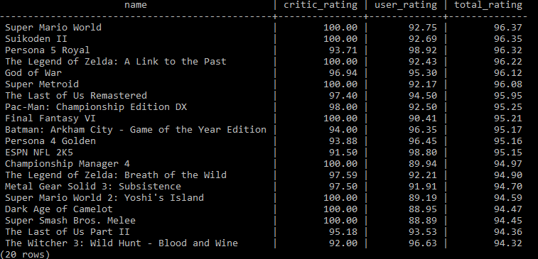

Videogame database
================
I decided to create my own database of videogame data in order to foster
my relational database knowledge and employ my SQL skills. Further, this
project employed a wholistic approach of integrating multiple
programming languages throughout to show how easily these languages can
interface with each other.

## Project Summary

<ul>
<li>
Created Python scripts to insert data obtained via [IGDB’s
API](https://api-docs.igdb.com/) into a PostgreSQL database of videogame
data
</li>
<li>
Gained insight as to how to create relational databases with multiple
tables and generated SQL queries calling multiple tables at once
</li>
<li>
Employed R to data scrape [VGChartz](https://www.vgchartz.com/) and
collect sales data about top rated video games
</li>
</ul>

## Data acquisition and database creation

Initial POST requests to the API were called using Postman to see the
total number of entries for each table and ensure that the API calls
were functioning correctly. Next, psql was used to create the games
database, and tables were created for each API endpoint. The Entity
Relationship Diagram (ERD) is shown below to help visualize the
relational tables.


After creating these tables, I used Python to automatically iterate
through the IGDB API and insert all data into the respective tables.
Below is an example of the code used for this.

``` python
import requests, time, psycopg2, datetime

#creating connection to PostgreSQL server, sensitive info censored
conn = psycopg2.connect("dbname='**' user='**' host='localhost' password='**'")
cur = conn.cursor()

#create a list of default dictionary keys to be used later in the script
#for assigning default values if key is missing
dict_defaults = ['num_critic', 'total_rating_count', 'rating_count', 'platforms', 'total_rating',
                  'aggregated_rating', 'rating', 'franchise', 'genres', 'first_release_date']

#URL for POST request
url = "https://api.igdb.com/v4/games"

#limit for number of games in the database, and set initial offset
lim = 136197
offset = 0

#while loop for iterating through all of the data, 500 pieces of data at a time
while offset < lim:

    #the actual data being sent through the POST request
    payload =  f"""
        fields id, name, franchise, genres, platforms, 
        first_release_date, aggregated_rating, rating, total_rating, 
        rating_count, total_rating_count;
        \r\nlimit 500;\r\noffset {offset};
        \r\nsort id;
        """

    #header created with sensitive info censored
    headers = {
    'Client-ID': '**',
    'Authorization': 'Bearer **',
    'Content-Type': 'application/javascript',
    'Cookie': '**'
    }

    #create the POST request
    response = requests.request("POST", url, headers=headers, data = payload)

    #save the response in a list of JSON
    json_data = response.json()
    
    #iterate through each JSON object in the list
    for data in json_data:

        #setting the default key-value pairs for missing keys in the dict
        for defaults in dict_defaults:
            data.setdefault(defaults, None)

        #attempt to feature engineer num_critic based off of other values
        #if error due to missing values, pass
        try:
            data['num_critic'] = data['total_rating_count'] - data['rating_count']
        except:
            pass

        #attempt to change timestamp info into UTC time for entry into database
        #else pass if missing
        try:
            data['first_release_date'] = 
              datetime.datetime.utcfromtimestamp(data['first_release_date']).strftime('%Y-%m-%d')
        except:
            pass
     
    #executemany inserts values into the database and iterates over the list to generate values 
    cur.executemany("""INSERT INTO games(game_id,name,franchise,genres,platforms,release_date,
      critic_rating,user_rating,total_rating,num_critic,num_user,num_total) VALUES (%(id)s, 
      %(name)s, %(franchise)s, %(genres)s, %(platforms)s, %(first_release_date)s, 
      %(aggregated_rating)s, %(rating)s, %(total_rating)s, %(num_critic)s, %(rating_count)s, 
      %(total_rating_count)s)""", json_data)

    #increase offset value for next POST request and pause for 0.25s 
    #since the API calls are limited to 4 per second
    offset += 500
    time.sleep(0.250)

#commit the insert to the database
conn.commit()
```

Creating a list of dictionary default values helps to A) speed up the
code and B) avoid having to do multiple if-else statements to check if
all key-value pairs existed in the data. Setting default values does not
overwrite the existing data and is much more efficient than something
like the following, which I initially coded:

``` python
...
json_data = response.json()
    for data in json_data:
        try:
          data['first_release_date'] = 
            datetime.datetime.utcfromtimestamp(data['first_release_date']).strftime('%Y-%m-%d')
          data['num_critic'] = data['total_rating_count'] - data['rating_count']
        except:
          data['num_critic'] = None
          if 'total_rating_count' not in data.keys():
            data['total_rating_count'] = None
            data['rating_count'] = None
        if 'franchise' not in data.keys():
            data['franchise'] = None
        if 'genres' not in data.keys():
            data['genres'] = None
        if 'aggregated_rating' not in data.keys():
            data['aggregated_rating'] = None
...
```

## Database queries

After having populated all of the tables, I am able to quickly get a
look at some of the data.

``` sql
SELECT name, 
       critic_rating, 
       user_rating, 
       total_rating 
  FROM games 
  WHERE critic_rating > 80 
        AND user_rating > 80 
  ORDER BY total_rating DESC 
  LIMIT 20;
```



``` sql
SELECT comp.name AS developer, 
       count(comp.name) 
  FROM
  (
    SELECT name, game_id, total_rating, user_rating, unnest(companies) AS companies FROM games
  ) g 
    INNER JOIN game_company_id gc 
    ON g.companies = gc.game_company_id 
      AND g.total_rating > 80 
      AND g.user_rating > 80 
      AND gc.developer is true

    INNER JOIN companies comp 
    ON comp.company_id = gc.company_id 
  GROUP BY comp.name 
  ORDER BY count(comp.name) DESC
  LIMIT 10;
```


``` sql
  SELECT comp.name AS publisher, count(comp.name) FROM
  (
    SELECT name, game_id, total_rating, user_rating, UNNEST(companies) AS companies FROM games
  ) g 
    INNER JOIN game_company_id gc 
    ON g.companies = gc.game_company_id 
      AND g.total_rating > 80 
      AND g.user_rating > 80 
      AND gc.publisher is true

    INNER JOIN companies comp 
    ON comp.company_id = gc.company_id 
  GROUP BY comp.name 
  ORDER BY count(comp.name) DESC
  LIMIT 10;
```


We can see that Nintendo and Capcom lead the pack in terms of number of
games developed and published with relatively high ratings (above 80%
from both critics and users).

## Web scraping

Lastly, I wanted to incorporate web scraping into this project by
reading the database into R and using the rvest package for xml parsing.
I decided to limit my search to the games rated 80% or above, which is
\~1000 games, and decided I would scrape sales data from
[VGChartz](https://www.vgchartz.com/).

Here is a snippet of the data generated using the R code supplied in
this repository:


## Conclusion

This project taught me how relational databases in SQL are created and
how important it is to create proper foreign key references and have
data normalization. My database does not have normalization, but
restructuring the data entry step in Python would allow for me to create
a normalized schema in the future.I was able to develop my data scraping
skills for obtaining data not already stored in databases by using R.
Lastly, I learned that it is relatively easy to leverage all tools
available in different languages like R and Python to meet project
demands.
